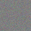
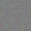
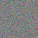
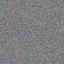
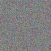
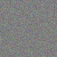
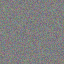
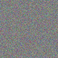
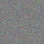
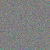

# Pok&eacute;mon sprite diffusion

We implement a simple version of the diffusion model from

> **Ho, Jonathan and Jain, Ajay and Abbeel, Pieter.**  
> *Denoising Diffusion Probabilistic Models*. Advances in Neural Information Processing Systems **33** (2020).  
> [https://arxiv.org/abs/2006.11239](https://arxiv.org/abs/2006.11239)

We replace the U-Net in the denoising network with a transformer. We also use the [cosine noise schedule](https://arxiv.org/pdf/2102.09672#equation.3.17) from

> **Nichol, Alexander Quinn and Dhariwal, Prafulla.**   
> *Improved Denoising Diffusion Probabilistic Models.* Proceedings of the 38th International Conference on Machine Learning, PMLR **139**:8162-8171, 2021.  
> [https://arxiv.org/abs/2102.09672](https://arxiv.org/abs/2102.09672)

We train our model on a subset of Pok&eacute;mon sprites from the second generation of Pok&eacute;mon games: Gold, Silver, and Crystal. We use the front facing sprites sourced from [PokeAPI/sprites/sprites/pokemon/versions/generation-ii](https://github.com/PokeAPI/sprites/tree/master/sprites/pokemon/versions/generation-ii), removing all 26 of the [Unown](https://bulbapedia.bulbagarden.net/wiki/Unown_(Pok%C3%A9mon)) variants. The resulting dataset has 750 images with each unique Pok&eacute;mon appearing in two to three poses (most of the sprites in Pok&eacute;mon Crystal are either slight modifications or outright copies of the sprites from either Pok&eacute;mon Gold or Pok&eacute;mon Silver). As the sprites vary in resolution (40x40, 48x48, 56x56), we scale them all to 64x64 pixels.

Contrary to the [motto](https://www.youtube.com/watch?v=R4GIyJxvk94) from the first season of the Pok&eacute;mon anime, we do not aim to be "the very best, like no one ever was". Instead, we train a relatively small model with 16,207,824 million parameters for 4500 epochs. We include the full list of parameter choices below.

## Model generations

Insert table of reverse diffusion samples (x-axis: timesteps, y-axis: model epochs) 

## Model parameters

#### DiffusionTransformer parameters

| Parameter    | Value  | Description |
|--------------|--------|-------------|
| image_size   |  64    | Resolution of (square) input images. |
| patch_size   |  4     | Size of each image patch. |
| in_channels  |  3     | Number of channels. |
| emb_dim      |  288   | Embedding dimension for patch representations. |
| depth        |  16    | Number of transformer layers. |
| nheads       |  8     | Number of attention heads per layer. |
| mlp_ratio    |  4     | Ratio between the MLP hidden dimension and the embedding dimension. |

#### GaussianDiffusion parameters

| Parameter  | Value         | Description |
|------------|---------------|-------------|
| denoise_fn | DiffusionTransformer instance | The denoising network used during diffusion. |
| timesteps  | 1000          | Number of diffusion steps. |
| schedule   | [cosine](https://arxiv.org/pdf/2102.09672#equation.3.17) | Noise schedule type. |

## Complications and remedies
The paucity of images in our dataset leads to sampling issues during training, which propagate to stability issues during inference. In particular, with only 750 images and 1000 timesteps, each timestep is only expected to be chosen .75 times during any given epoch. Thus, the model is less likely to be trained on the highest variance distortions of the dataset. Empirically, we find that the model is highly sensitive to the variance of the Gaussian input `noise` during inference. A standard Gaussian leads to poor image quality, very often of a uniform color. We remedy this by scaling the noise to have the same variance as the harmonic mean of the variance schedule:

<pre>
  harmonic_mean = 1/((1/(1-diffusion.alphas_cumprod)).mean())
  noise *= torch.sqrt(harmonic_mean)
</pre>

We observe substantial improvements in the empirical performance of the model with this minor modification.

(INCLUDE ROWS OF VARIANCE FOR COMPARISON)

In principal, the same issue applies to the channel means of the noise. One can shift the mean to compensate for this, but we did not find any improvements in performance for various approaches. We document our attempts and the outcomes below: for each timestep, we start by computing the arithmetic mean over each channel for each image in the dataset (the resulting tensor `forward_statistics` has shape (timesteps, channels, W, H))

- Approach 1: compute the arithmetic mean over the timesteps `forward_statistics.mean(dim=0)`. Using this as the mean of our noise created too large of a shift and resulted in entirely white images. Note that `forward_statistics.mean() = tensor(0.2494)`.
- Approach 2: compute the harmonic mean over the timesteps `1/((1/forward_statistics).mean(dim=0))`. The resulting tensor has `.abs().max() = tensor(4.3705e-05)` and does not produce noticeable differences during inference.
- Approach 3: compute the arithmetic mean over the last `N` timesteps for `N` relatively small `forward_statistics[-N:].mean(dim=0)`. This has the advantage of producing a smaller shift than Approach 1 if `N` is chosen to be somewhere in the range of `[1,10]`  but did not lead to any improvement in image quality.

One could also try to compensate for the lack of high variance distortions by modifying the training algorithm to favor sampling later times. For example, `t = torch.multinomial(time_weights, batch.size(0), replacement=True)`. This is implemented in the model as `late_train_diffusion()`. We tried an additional 500 epochs on our pretrained model using this sampling method and it indeed produce better results on unit variance noise, but the generations were still low quality. It is possible that additional compute would provide continued improvements.

## Future directions
The model is limited by, among other things, computing resources and the shortage of sprites. One could consider enlarging the dataset by including sprites from Generation I, but the style of the sprites is inconsistent with Generation II. Generations III-V are all of a similar style and can reasonably be lumped together to produce a much larger dataset (3000+ images).

## Data sources
Training images used in this project were obtained from the [PokeAPI/sprites repository](https://github.com/PokeAPI/sprites).
